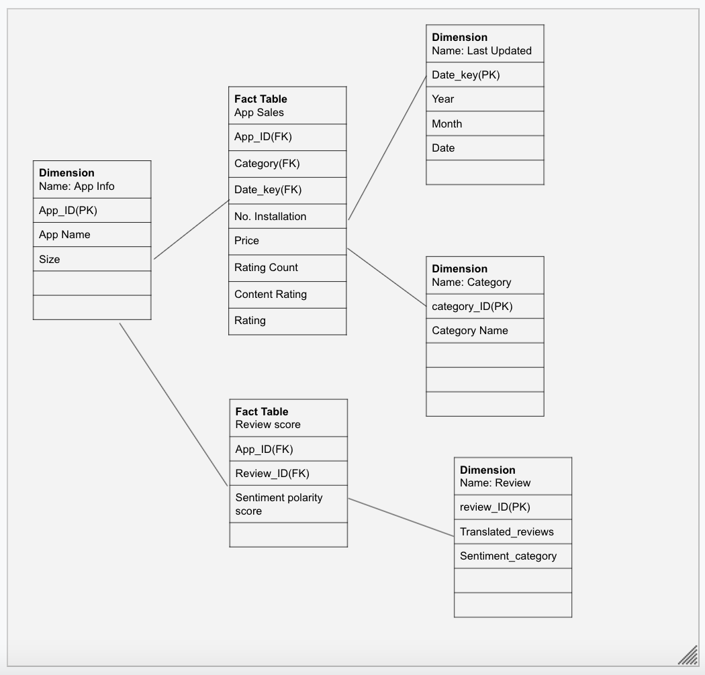
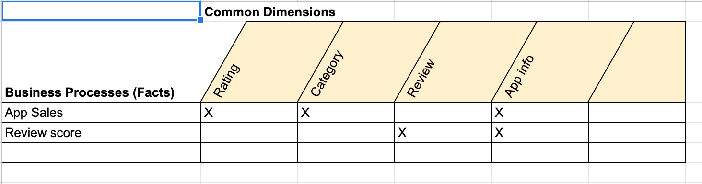
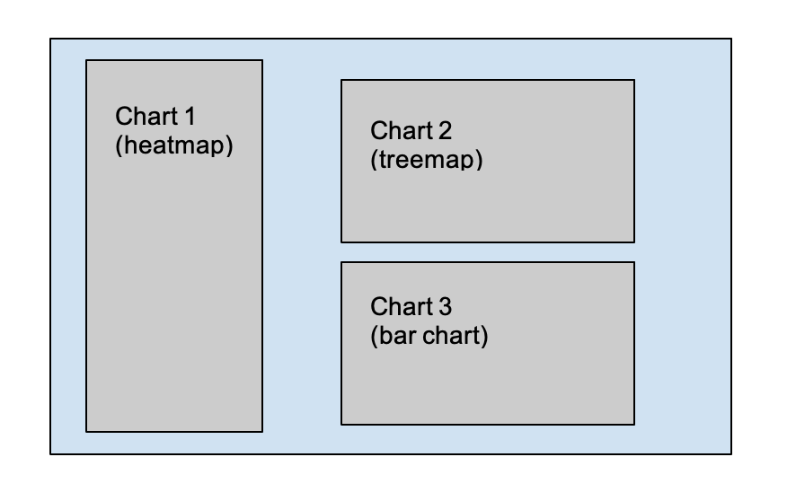
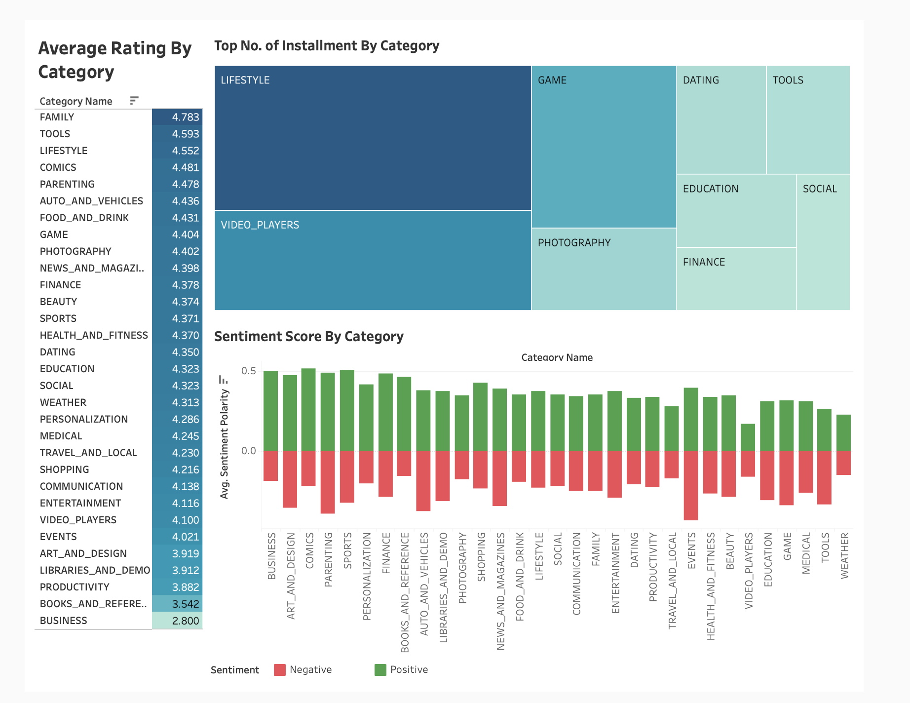

# google-playstore-project
- Adrian Lulanaj, Yael Yana Reinus, Xiang Wang
- Created May 16, 2021
- CIS 9440

Project Objective: Follow the Kimball Lifecycle to design and develop a public, cloud-based Data Warehouse with a functioning BI Applications

Project Tools:
The tools used to build this Data Warehouse were: 
1. For data integration - python
2. For data warehousing - Google BigQuery
3. For Business Intelligence - Tableau

## Kimball Lifecycle Project Stages

### Project Planning

## Motivation for project:
To seize opportunities within the mobile app market that can have promising yields.

## Description of the issues or opportunities the project will address:
The different factors of apps within the Google Play Store can be more thoroughly analyzed to uncover whether there are correlations that lead to the success of some apps.

## Project Business or Organization Value:
### High-level Business Initiative:

Determine whether there are specific factors that lead to the success of some apps.

### BI Sponsors and Stakeholders 

Game developer app agencies. 

### What’s the Business Value?

If we can determine whether there are certain factors that lead to success of some apps, then the game developer app agencies that are our stakeholders can tailor their development with these factors in mind, increasing the probability of success and profitability of these apps. 

### How long will this take? How much will this cost?

3 months - the length of this course. We will be using Google BigQuery for cloud storage and future query. Our dataset is about 9MB for two datasets with the storage costs at $0.02/GB/month. Our estimated costs will be less than a dollar per month. 

## Data Sources:
Both datasets are included in this Kaggle link.
1.https://www.kaggle.com/lava18/google-play-store-apps?select=googleplaystore.csv 

### Business Requirements Definition

List of Data Warehouse KPI's:
1. Rating per price range
2. No. Installs per Category
3. free vs paid application per category
4. Average rating in each category
5. Average price in each category
6. positive/negative sentiment score per category 

### Dimensional Model

This project's Dimensional Model consists of 2 Facts and 3 Dimensions

Use correct file path here to show picture of dimensional model...

This project's Kimball Bus Matrix:

Use correct file path here to show picture of dimensional model...

### Business Intelligence Design and Development

List of Visualizations for each KPI:
1. BFor Average Rating per Category, we used a heat map/list. This type of visualization was used because it allows us to have a total view of all the categories and their respective ratings. Any other visualization would most likely leave out some of the categories which defeats the purpose of this KPI as outlined previously.

2. For No. Installs per Category, we used a treemap. The purpose of this KPI is to relate the total amount of installations for each category with one another. With a treemap, this allows us to visually see a difference between each category as the larger squares represent the categories that have more installations. The treemap is also color coded to show which categories have more installations.

3. For Sentiment Per Category, we used a bar chart. The sentiment score can be broken up into two components: positive and negative, with a range of 0 to 1 for either. A bar chart allows us to depict both components for each category which we can differentiate with color coding. 

BI Application Wireframe design:

Use correct file path here to show picture of Wireframe design...

Picture of final Dashboard:

Use correct file path here to show picture of Dashboard...

### Deployment

The project was deployed on Tableau Online: https://prod-useast-b.online.tableau.com/#/site/amyw/workbooks/95521?:origin=card_share_link
